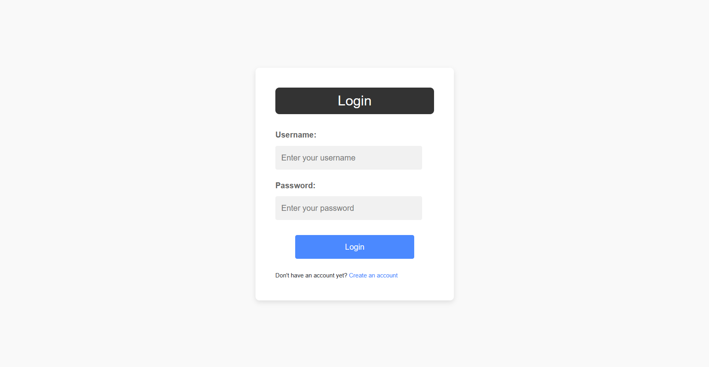
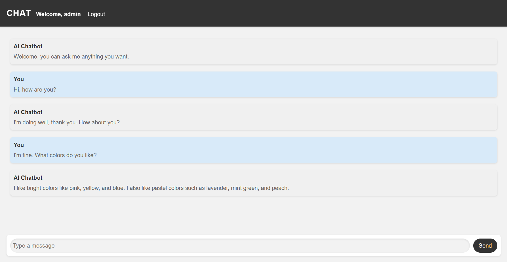

# Django Chatbot

## 💻 Screenshots

   
   

## ⚙️ Setting up

1. Download the repo using `https://github.com/dawidj126/django_chatbot.git` in your terminal or directly from github page in zip format.
2. Install OpenAI library using `pip install openai`.
3. Enter your unique OpenAI API Key. Go to `core/views.py` and search for `your-api-key`. You have to replace it with your API Key.
4. Once you're done. You can run server. Type `python .\manage.py runserver` in your terminal. To run that command, make sure you are in a right directory. You should be in folder where `manage.py` file is located.
